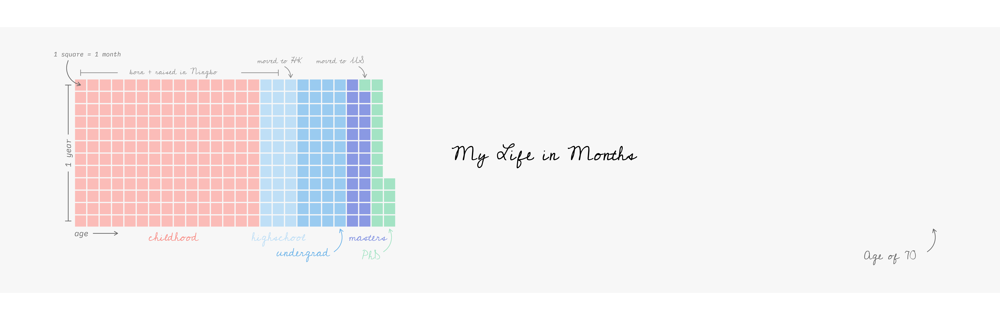

___

Forked from https://github.com/sharlagelfand/mylifeinmonths

**By the original author:**

My life in months, inspired by [Isabella
Benabaye](https://isabella-b.com/blog/my-life-in-months/)\!

____

**Key Tools:**

R Packages:
- ggplot2
- waffle

**To do:**

- [ ] Authomate the coloring
- [ ] Color the future blocks with identifiable color
- [ ] Polish Code
___

**Try my own:**

